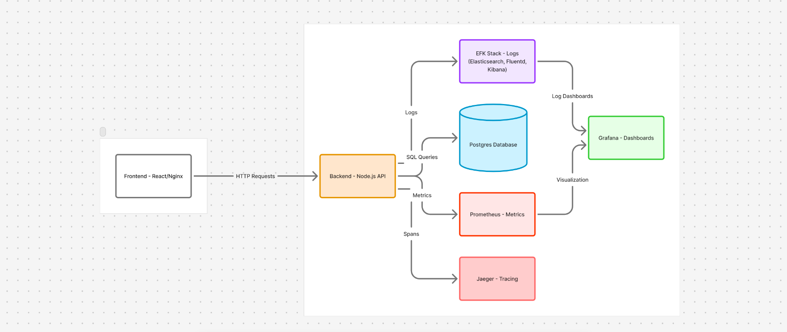

# TaskOps — Full Setup & Deployment Guide (Local + Kubernetes)

A detailed, end‑to‑end walkthrough of how to set up, run, and deploy the **TaskOps** web application both locally (Docker Compose) and on AWS EKS Kubernetes.

## ⚙️ TaskOps Architecture

<p align="center">
  
</p>

---

## 📦 1. Project Overview

**Stack Components:**

* **Frontend:** React + Vite + Nginx
* **Backend:** Node.js (Express) + Jaeger tracing
* **Database:** PostgreSQL (persistent data)
* **Observability:** Jaeger, Prometheus/Grafana (optional)

**Architecture:**

* Local: Docker Compose orchestrates all containers.
* Kubernetes: Each service runs as a Deployment/StatefulSet inside namespace `taskops`.

---

## 🧰 2. Prerequisites

### For Local Setup

* Docker & Docker Compose
* Node.js & npm (optional, for local builds)

### For Kubernetes Setup

* AWS CLI (configured with IAM credentials)
* eksctl
* kubectl
* AWS EBS CSI Driver addon (we’ll install it)

---

## 🧪 3. Local Setup via Docker Compose

### Step 1 — Clone Repo & Navigate

```bash
git clone <repo_url>
cd taskops
```

### Step 2 — Verify directory structure

```
backend/
frontend/
k8s/
docker-compose.yml
```

### Step 3 — Build & Run

```bash
docker compose build
```

Then run all services:

```bash
docker compose up -d
```

### Step 4 — Verify containers

```bash
docker ps
```

You should see `frontend`, `backend`, `postgres`, and `jaeger` running.

### Step 5 — Access services

* Frontend → [http://localhost:5173](http://localhost:5173)
* Backend → [http://localhost:4000](http://localhost:4000)
* Jaeger → [http://localhost:16686](http://localhost:16686)

**Note:** If backend errors like `ECONNREFUSED`, restart containers after Postgres becomes healthy.

### Step 6 — Shut down

```bash
docker compose down -v
```

---

## ☸️ 4. Kubernetes Setup on AWS EKS

### Step 1 — Create Cluster (EKS) OR use given terraform infra file

```bash
eksctl create cluster \
  --name taskops-cluster \
  --region ap-south-1 \
  --nodegroup-name workers \
  --nodes 2 --nodes-min 2 --nodes-max 3 \
  --node-type t3.small \
  --managed
```

### Step 2 — Configure Kube Context

```bash
aws eks update-kubeconfig --region ap-south-1 --name taskops-cluster
kubectl config use-context taskops-cluster
```

### Step 3 — Verify nodes

```bash
kubectl get nodes
```

### Step 4 — Create Namespace

```bash
kubectl create namespace taskops
```

### Step 5 — Create Secrets for DB

```bash
kubectl create secret generic db-secret \
  -n taskops \
  --from-literal=DB_USER=taskops \
  --from-literal=DB_PASSWORD=taskopspass \
  --from-literal=DB_NAME=taskops
```

### Step 6 — Install AWS EBS CSI Driver (for storage)

```bash
eksctl utils associate-iam-oidc-provider \
  --cluster taskops-cluster --region ap-south-1 --approve

eksctl create iamserviceaccount \
  --name ebs-csi-controller-sa \
  --namespace kube-system \
  --cluster taskops-cluster \
  --attach-policy-arn arn:aws:iam::aws:policy/service-role/AmazonEBSCSIDriverPolicy \
  --approve \
  --role-name AmazonEKS_EBS_CSI_DriverRole

ACCOUNT_ID=$(aws sts get-caller-identity --query Account --output text)
eksctl create addon \
  --name aws-ebs-csi-driver \
  --cluster taskops-cluster \
  --service-account-role-arn arn:aws:iam::$ACCOUNT_ID:role/AmazonEKS_EBS_CSI_DriverRole \
  --region ap-south-1 --force
```

### Step 7 — Create StorageClass (gp3)

```bash
cat <<EOF | kubectl apply -f -
apiVersion: storage.k8s.io/v1
kind: StorageClass
metadata:
  name: gp3
  annotations:
    storageclass.kubernetes.io/is-default-class: "true"
provisioner: ebs.csi.aws.com
parameters:
  type: gp3
reclaimPolicy: Delete
volumeBindingMode: WaitForFirstConsumer
allowVolumeExpansion: true
EOF
```

---

## 🐘 5. Deploy Postgres

`k8s/10-postgres.yaml`

Apply it:

```bash
kubectl apply -f k8s/10-postgres.yaml
```

Verify:

```bash
kubectl get pods -n taskops
kubectl get pvc -n taskops
```

Expect `postgres-0` → Running.

---

## ⚙️ 6. Deploy Backend

`k8s/20-backend.yaml`

Apply it:

```bash
kubectl apply -f k8s/20-backend.yaml
```

Check service:

```bash
kubectl get svc backend -n taskops
```

Copy the `EXTERNAL-IP` once available.

---

## 🖥️ 7. Deploy Frontend

`k8s/30-frontend.yaml`

Apply it:

```bash
kubectl apply -f k8s/30-frontend.yaml
```

Check external IP:

```bash
kubectl get svc frontend -n taskops
```

Access the URL → open in browser.

---

## 🔍 8. Deploy Jaeger (Tracing)

```bash
kubectl apply -f k8s/40-jaeger.yaml
```

`k8s/40-jaeger.yaml`:


Port-forward if you want to access the UI locally:

```bash
kubectl port-forward svc/jaeger 16686:16686 -n taskops
```

→ Visit [http://localhost:16686](http://localhost:16686)

---

## ✅ 9. Verification Checklist

```bash
kubectl get pods -n taskops
kubectl get svc -n taskops
```

Expected:

```
postgres-0      1/1 Running
backend-*       1/1 Running
frontend-*      1/1 Running
jaeger-*        1/1 Running
```

Access:

* Frontend: LoadBalancer URL (React UI)
* Backend: LoadBalancer URL (for API)
* Jaeger: port-forward → localhost:16686

---

## 🧹 10. Cleanup

```bash
kubectl delete namespace taskops
```

or:

```bash
eksctl delete cluster --name taskops-cluster --region ap-south-1
```

---

## NOTE - Checkout Debug folder if any issue occurs.
---

**End of Guide — TaskOps Local + EKS Deployment**
